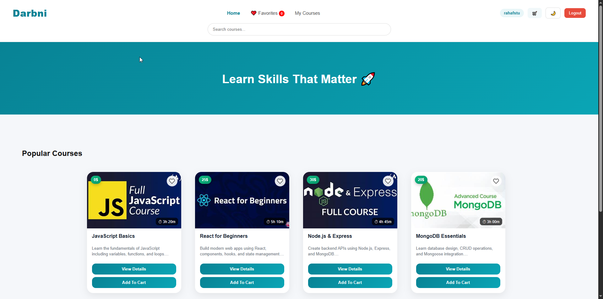
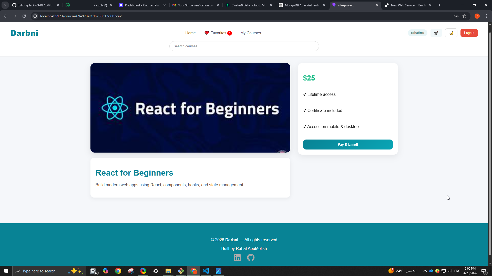
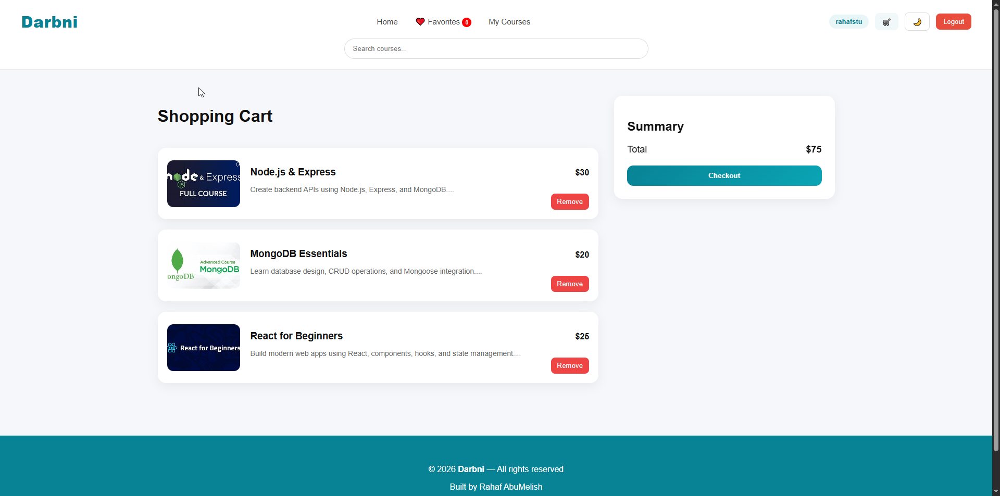
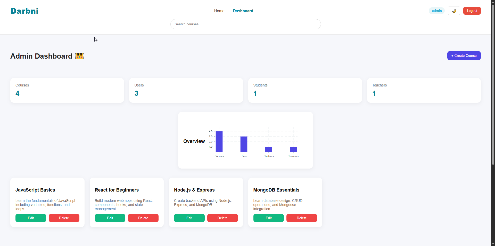

# 🎓 Courses Platform

A full-stack web application for managing and enrolling in online courses.

---

## 🚀 Features

- User authentication (Register / Login)
- Guest users can browse available courses
- Login required before enrolling in any course
- Role-based access control:
  - Student
  - Teacher
  - Admin
- Create, edit, and delete courses
- Search courses
- Add courses to favorites
- Shopping cart system
- Course enrollment system
- Stripe payment integration
- View enrolled courses
- Admin dashboard for managing users and courses
- Teacher create courses

---
## 📸 Screenshots
### Home Page

### Course Detail

### Cart

### Dashboard

## 🛠 Tech Stack

### Frontend
- React (Vite)
- React Router
- Axios

### Backend
- Node.js
- Express
- MongoDB
- JWT Authentication

---

## 🌍 Deployment

- Frontend: Netlify
- Backend: Render
- Database: MongoDB Atlas

## 🌍 Live Demo

Frontend: https://your-app.netlify.app  
Backend API: https://your-api.onrender.com

## 📁 Project Structure
proj33/
│
├── backend/
│
│   ├── controllers/
│   │   ├── courseController.js
│   │   ├── enrollmentController.js
│   │   ├── paymentController.js
│   │   ├── stripeWebhookController.js
│   │   └── userController.js
│
│   ├── middleware/
│   │   ├── auth.js
│   │   └── authorizeRole.js
│
│   ├── models/
│   │   ├── db.js
│   │   ├── userSchema.js
│   │   ├── courseSchema.js
│   │   ├── enrollmentSchema.js
│   │   └── paymentSchema.js
│
│   ├── routes/
│   │   ├── userRoutes.js
│   │   ├── courseRoutes.js
│   │   ├── enrollmentRoutes.js
│   │   ├── paymentRoutes.js
│   │   └── webhookRoutes.js
│
│   ├── .env          
│   ├── .gitignore
│   ├── server.js
│   └── package.json
│
│
├── frontend/
│
│   ├── src/
│   │
│   │   ├── api/
│   │   │   └── api.js        ← 🔥 Axios helper (new)
│   │   │
│   │   ├── components/
│   │   │
│   │   │   ├── Navbar.jsx
│   │   │   ├── Footer.jsx
│   │   │   ├── Home.jsx
│   │   │   ├── CourseCard.jsx
│   │   │   ├── CourseDetail.jsx
│   │   │   ├── Register.jsx
│   │   │   ├── Login.jsx
│   │   │   ├── Enrollments.jsx   
│   │   │   ├── Cart.jsx    
│   │   │   ├── AdminDashboard.jsx
│   │   │   ├── CreateCourse.jsx
│   │   │   ├── EditCourse.jsx
│   │   │   ├── ProtectedRoute.jsx
│   │
│   │   ├── context/
│   │   │   └── AuthContext.jsx
│   │   ├── App.jsx
│   │   └── main.jsx
│   ├── .env
│   ├── index.html
│   └── package.json
│
└── README.md
